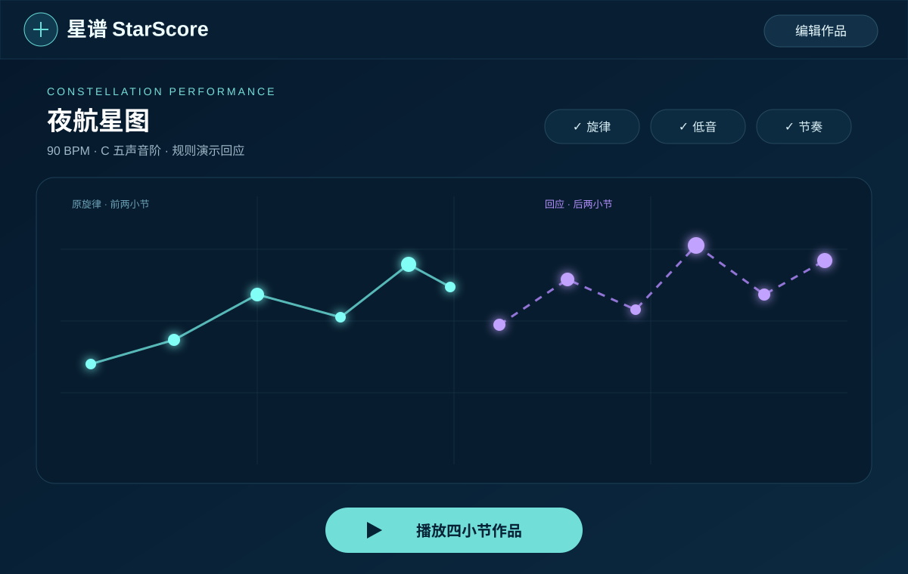

# 星谱 StarScore

> **v0.2.0 银河相遇版**：默认进入 `#/community`，在本机银河中试听 7 位示例居民的 14 段原创星谱，创建灵感副本后继续作曲、生成回应并分享星系文件。

[公开仓库](https://github.com/Qingtian-Zeng/starscore) · [独立 HTML 演示](demos/StarScore_Interactive_Preview.html) · 新版 APK/Release 链接在 v0.2.0 发布后更新

## 银河相遇版新增

- 银河社区成为主入口，含可跳过进入动画、减少动态、星云详情、随机倾听、关注与喜欢。
- 十二星座提供 12 段原创主题，星谱素材提供 6 段原创预设；试听不跳页，点击星图建立独立副本。
- 路由保留 `zodiac`、`materials`、`library`、`community` 来源；社区灵感副本返回具体作者星云。
- 作者可把 1—8 段本机作品发布为本机星云，并交换 `.starscore-galaxy.json`。当前不是实时在线社区。
- Web/App 无 API 时使用共享 core 的规则回应；真实模型仍只读取服务端配置。
- 静态 Web 可直接下载 JSON/MIDI；Android 用 Filesystem + Share 分享 JSON、MIDI 与星系文件。

新增路由：`#/community`、`#/community/:galaxyId`、`#/discover/zodiac`、`#/discover/materials`。原画室、作品库、演奏页及 IndexedDB `starscore` 数据保持兼容。

> 画一片星空，听它长成音乐。

StarScore 是一款面向零乐理用户的可视化音乐创作工具：在星图上点下音符、拖动改变音高，用星尾表达时值、光晕表达力度，再让规则生成器或真实模型为前两小节续写回应。作品可在 Web 与 Android 测试版中播放、保存并导出 JSON/MIDI。



## 创新点

- **星图即乐谱**：空间布局、音高、时值和力度保持同步，创作结果是真实可播放的音乐数据。
- **可比较的音乐回应**：一次生成 A/B 两个后两小节候选，可完整试听“原旋律 + 回应”，采用操作支持撤销/重做。
- **规则与模型同一契约**：离线规则生成器与真实模型适配器复用音阶、节奏、长度和 tick 边界校验。
- **完整作品闭环**：IndexedDB 作品库、复制作品、JSON 无损交换、三声部 MIDI 导出，以及共享音乐时钟下的旋律、低音与鼓环。
- **Web/App 共用核心**：React Web、Capacitor Android、Node API 与共享音乐核心处于同一 monorepo。

## 功能

- 星图画室：点星、拖动改音高、编辑音长/力度、删除与单链重连
- 播放引擎：90 BPM、4/4、旋律/规则低音/八格鼓环独立开关
- AI 回应：规则演示与服务端真实模型适配器，候选试听、采用、撤销
- 我的星系：命名、保存、复制、刷新恢复及作品缩略图
- 文件交换：完整校验的 JSON 导入/导出、两轮八小节三声部 MIDI
- Android：Capacitor 工程、品牌图标/启动资源、后台自动停止与系统分享

## 快速运行

要求 Node.js 22+（云端交付构建使用 Node.js 24）。

```bash
npm ci
npm run dev:api
```

另开终端运行 `npm run dev:web`，打开 `http://127.0.0.1:5173/`。

- `#/studio`：星图画室
- `#/library`：我的星系
- `#/play/:projectId`：演奏页

规则演示无需模型配置。真实模型只从 API 服务端读取 `STARSCORE_MODEL_BASE_URL`、`STARSCORE_MODEL_NAME`、`STARSCORE_MODEL_API_KEY`；密钥不得写入 Web 或 APK。配置示例见 [.env.example](.env.example)。

## 构建与验证

```bash
npm run check
npm run build
```

生产容器：

```bash
docker compose up --build -d
node scripts/verify-deployment.mjs http://127.0.0.1:8080
```

Android 本地构建需要 JDK 21 与 Android SDK 36：

```bash
npm run android:sync
cd apps/web/android
./gradlew assembleDebug
```

也可在 GitHub Actions 手动运行 **StarScore delivery build**；工作流使用 Ubuntu 24.04、JDK 21 和 Android SDK 36，并上传 debug APK 与构建证据。

## 当前验收状态

| 项目 | 状态 |
|---|---|
| Core/API/Web 类型检查与自动测试 | ✅ 已通过 |
| Web 生产构建 | ✅ 已通过 |
| GitHub Actions Android `assembleDebug` | ✅ 已通过 |
| Compose Web、同源 API、健康检查、规则回应 | ✅ 已通过 |
| JSON/MIDI 程序化回读与核心创作闭环 | ✅ 已通过 |
| 真实模型调用 | ⏳ 待提供服务端模型配置 |
| Android 模拟器/真机安装与生命周期 | ⏳ 待设备验证 |
| 10 组人工听感与外部 DAW | ⏳ 待人工验证 |
| HTTPS 公网部署 | ⏳ 待托管环境 |

详细证据与未完成项见 [QA](docs/QA.md)、[进度记录](docs/PROGRESS.md)、[App 构建说明](docs/APP_BUILD.md) 和 [部署说明](docs/DEPLOYMENT.md)。

## 项目结构

```text
apps/web        React + Vite + Capacitor 客户端
apps/api        Node API、规则生成器与模型适配器
packages/core   乐谱契约、校验、项目与 MIDI 逻辑
deploy          Docker、Nginx 与 Compose 配置
docs            QA、进度、构建、部署与演示文档
samples         JSON/MIDI 示例作品
```

## 数据与隐私

作品默认保存在浏览器 IndexedDB，不会自动上传。模型密钥仅存在于服务端环境变量。公开仓库不包含 `.env`、密钥、`node_modules`、临时构建目录或签名文件。
